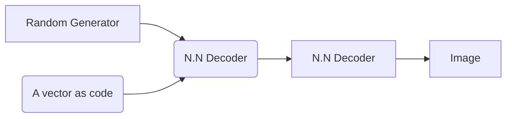
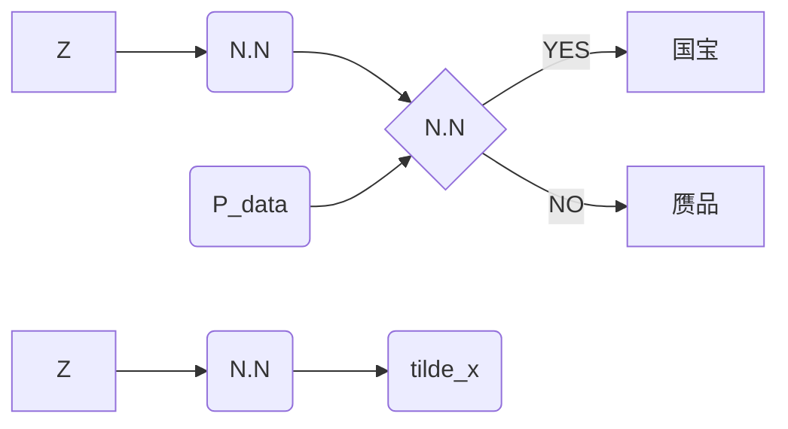

[toc]

# GAN 学习笔记

[生成模型](https://openai.com/blog/generative-models/)  

[WGAN Blog](https://vincentherrmann.github.io/blog/wasserstein/)

[GAN 推荐学习网站](https://github.com/ML-Note/GAN)

## 生成模型

什么是生成模型？

- GMM: 用来做聚类，（非监督学习）
- NB（朴素贝叶斯）：（监督学习，可以用来做垃圾邮件分类）
- Logistics 回归是生成模型吗？No！

生成模型与解决的任务之间没有必然的联系，关注的是样本本身。对于监督学习$p(x， y)$ , 非监督学习 $p(x,z)$ ， 有些模型甚至仅用 $X$ , 成为 Autoregression model 。 

## GAN(生成式对抗网络)

- 工艺大师的目的：成为高水平，可以以假乱真的大师。($P_g \rightarrow P_d $)

如果用统计模型去刻画这个模型，如何去表示？模型中的生成器和判别器可以通过一些模型去表示。

**GAN的流程**：

- Initialize the generator and dicriminator 
- In each traning iteration 
  - Step 1 : Fixed generator G , and update discriminator D.
  - Step 2 : Fixed Discriminator D ,  and update generator G ;

### Auto - Encoder

### VAE

这里会对 $\sigma$ 进行限制：
$$
\min ~ \sum_{i} ^{3} \left[ exp(\sigma_{i}) - (1+\sigma_{i}) + m_{i}^{2} \right]
$$
VAE存在着一些问题：它不能真的尝试去模拟真的图像

## GAN——数学表示

**数学符号：**

- $\{x_{i}\}_{i}^{N}$  样本数据
- $P_{data}：$ Population Density
- $P_g(x;\theta_{g}):$ 生成模型的density； 可以用 `NN` 进行逼近
- $z \sim P_{Z}(Z)$ , Proposed Density，一般用来生成 $\tilde{x}_{i}$
- $D(Z) = D(\tilde{x},\theta_{d}):$  表示 Discrimination 识别是否是“国宝”的概率，越接近于1，越可能是国宝

- $\tilde{x} = G(z;\theta_g)$ 

对于高专家来说：

- 如果 $x$ 是来自于 $P_{data}$ , 我们可以发现 $D(x;\theta_{d})$是较大的 $\Longrightarrow$ $\log(D(x;\theta_{d}))$ 是较大点的；
- 如果 $x$ 是来自于 $P_{generator}$ , 我们可以发现 $D(x;\theta_{d})$是较小的 $\Longrightarrow$ $1 - D(x;\theta_{d})$是较大点的$\Longrightarrow$ $\log(1 -D(G(Z))$是较大的；

所以对于高专家的目标函数为：
$$
\max_{D} \rm E_{x \sim P_{data}} [~\log P(x)~] + E_{z \sim P_{z}} [~ \log (1 - D(Z))~]
$$
对于高级技师来说，想以假乱真：

- 如果 $x$ 是来自于 $P_{generative}$ , 我们可以高级技师希望 $D(x;\theta_{d})$是较大的 $\Longrightarrow$ $\log(1 -D(G(Z))$是较小的；

$$
\min_{G}~ \rm  E_{Z \sim P_{Z}} [~ \log( 1- D[G(Z)]) ]
$$

所以在这个体系中，总的目标为：
$$
\min_{G} \max_{D} ~ \rm E_{x \sim P_{data}} [~\log P(x)~] + E_{z \sim P_{z}} [~ \log (1 - D(Z))~]
$$
小结：GAN的复杂度在于模型的学习，我们并没有直接面对$P_g (x , \theta_{g})$ ，而是用神经网络去逼近$P_g (x , \theta_{g})$ ,所以GAN是一种 Implict Density Model 。

## GAN存在最优解吗？

一般来说，我们会从MLE (Maximum Likelihood Estimation) 角度去解目标函数，但在GAN模型中，我们可以不通过MLE，而通过神经网站逼近Prob Density。

###  f-divergence

**Definition**: P and Q are two distribution . $p(x)$ and $q(x)$ are the probability of sampling of sampling x.
$$
D_{f}(P||Q) = \int_{x} q(x)f\left( \frac{p(x)}{q(x)}\right) dx
$$
**Remark** : $f$ function is  convex , $f(1) = 0$ , $D_{f}({P||Q})$ evaluates the differences of P and Q.

- if $p(x)$ =  $q(x)$ for all $x$,  $D_{f}({P||Q}) = 0$ ; if $p(x) = q(x)$ for some $x$ ,  
  $$
  D_{f}({P||Q})= \int_{x} q(x) f \left( \frac{p(x)}{q(x)}\right) dx \geq f \left[ \int_{x} q(x) \cdot \frac{p(x)}{q(x)} dx \right] = 0
  $$

  | $f(x) = x\log x$   | KL:  $D_{f}({P||Q})= \int_{x}  q(x) \frac{p(x)} {q(x)} \log \left( \frac{p(x)}{q(x)}\right) dx  = \int_{x}  p(x) \log \left( \frac{p(x)}{q(x)}\right) dx $ |
  | ------------------ | ------------------------------------------------------------ |
  | $f(x) = -\log x$   | Reverse KL : $D_{f}({P||Q})= \int_{x}   - q(x)  \log \left( \frac{p(x)}{q(x)}\right) dx  = \int_{x}  q(x) \log \left( \frac{q(x)}{p(x)}\right) dx$ |
  | $f(x) = (x-1)^{2}$ | Chi square : $D_{f}({P||Q})= \int_{x}    q(x)   \left( \frac{p(x)}{q(x)} - 1 \right) ^{2} dx  = \int_{x}  \left( \frac{\left(p(x) - q(x)\right)^{2}}{p(x)}\right) dx$ |

**Fenchel Congjugate**

- every conex function $f$ have a Congjugate function $f^{*}$；$f^{*}$ also is a convex function .   We can find that $(f^{*})^{*} = f$
  $$
  f^{*}(t) = \max_{x \in dom (f)} {xt - f(x)}  \Longleftrightarrow 
  f (x) = \max_{t \in dom (f^{*})} {xt - f^{*}(t)}
  $$
  

if $f(x) = x \log x $  ,  $f^{*}(t) = e^{t-1}$

$$
\begin{aligned}
D_{f}(P||Q) & = \int_{x} q(x)f\left( \frac{p(x)}{q(x)}\right) dx \\
            & = \int_{x} q(x) \left[ \max_{t \in dom(f)}  
             \left( \frac{p(x)}{q(x)} t - f^{*} (t) \right) \right]dx \\
            & \approx \max_{D} \int_{x} p(x)D(x)dx - q(x)f^{*}\left(D(x) \right) dx 
\end{aligned}
$$
 Where  $ t = D(x)$ ; D is a function ,  whose input is $x$ , Output is $t$
$$
\begin{aligned}
D_{f}(P||Q) & \ge  \int_{x} q(x) \left[  
             \left( \frac{p(x)}{q(x)} D(x) - f^{*} \left(D(x) \right) \right) \right]dx \\
            &  =  \int_{x} p(x)D(x)dx - q(x)f^{*}\left(D(x) \right) dx
 \end{aligned}
$$
因此，这个共轭函数与GAN之间有什么关系：
$$
\begin{aligned}
D_{f}(P||Q) & \approx \max_{D} \int_{x} p(x)D(x)dx - q(x)f^{*}\left(D(x) \right) dx \\
  & = \max_{D} \{ E_{x\sim P(x)} [D(x)] + E_{x \sim Q(x) } [f^{*} (D(x))] \} \Longrightarrow \\
 D_{f}(p_{data}||p_{g})  & =   \max_{D} \{ E_{x\sim p_{data}} [D(x)] + E_{x \sim p_{g} } [f^{*} (D(x))] \} 
\end{aligned}
$$
我们寻找 `Generator` 时， 需要让 `f - div  `最小， 即
$$
G^{*} = \arg \min_{G} D_{f}(p_{data}||p{g}) = \arg \min_{G} \max_{D} \{ E_{x\sim p_{data}} [D(x)] + E_{x \sim p_{g} } [f^{*} (D(x))] \} 
$$

### MLE角度

- Given a data distribution
- We have a distribution of $p_{g}(x,\theta)$ parametriced by $\theta$
  - Eg :  $p_{g}(x,\theta)$ can be a Gaussian Dist , $\theta$ must be the mean and varience.
  - We want to find $\theta$ ， such that $P_{g}(x; \theta)$ close to $P_{data}(x)$
  - Sample {$x_{1}, x_{2}, \cdots, x_{m}$} from $P_{data}(x)$, We can compute $P_{G}(x^{i},\theta)$，

Likelihood of generating the samplings 
$$
\begin{aligned}
\theta^{*} & = \arg\max_{\theta} L(x;\theta)   =  \arg\max_{\theta} \prod_{i}^{m} P_{G}(x^{i}; \theta) 
        = \arg \max_{\theta} \sum_{i}  \left[\log P_{G}(x^{i}; \theta) \right] \\
        & = \arg \max_{\theta}  \int  p_{data} \left[\log P_{G}(x^{i}; \theta) \right] dx
        = \arg \max_{\theta} E_{x \sim p_{data}} \left[\log P_{G}(x^{i}; \theta) \right] 
        ~\quad\{x_{1}, x_{2}, \cdots, x_{m} \} ~~ from ~~ P_{data}(x) \\
        & = \arg \max_{\theta}  \int  p_{data} \left[\log P_{G}(x^{i}; \theta) \right] dx -
         \int  p_{data} \left[\log P_{data}(x^{i}; \theta) \right] dx \\
        & = \arg \max_{\theta}  \int  p_{data} \left[  \log \frac{P_{G}(x^{i}; \theta)}
          {P_{data}(x)} \right] dx \\
        & = \arg \min_{\theta} KL[~ p_{data}(x) || p_{G}(x;\theta)~]
        
        
\end{aligned}
$$
$KL[~ p_{data}(x) || p_{G}(x;\theta)~]$ 是度量两个分布之间的距离，如果两个Dist 越小，则这两个Dist 比较相近。

常规的模型是直接对$P_{g}$直接进行建模，从 $P_{g}$ 得到 $\theta_{g}$，从MLE的角度来看：
$$
\theta_{g} = \arg\max _{\theta_{g}} \sum_{i} ^{N} \log [~p(x_{i})~] = \arg \min KL[~p_{data}||p_{g}~]
$$

### GAN角度

这里出现了一个问题，我们并不知道 $P_{g}$ 和 $P_d$ 这两个分布，怎么去求解？在GAN角度中,我们可以通过从  $p_{g}$ 和 $p_d$ 中抽样的方法去求解生成器。

站在GAN的角度如何测量`KL Div`

GAN是从对抗学习的角度，因此我们要思考最优解存在吗？如果存在，$P_{g} \stackrel{？}{=} P_{d a t a}$

我们引用论文中的符号：
$$
V(G,D) \equiv  \rm E_{x \sim p(x)} \left[ \log (x)\right] 
+ E_{x \sim p_{g}} \left[ \log \left(  1 - D\left(X \right )\right) \right]
$$
因此我们的目标函数可以写为：
$$
\min_{G} \max_{D}~ V(G,D)
$$
Asumption:

- $G(x)$ can be any fuction

求解步骤：

- Step 1 :  Given G , what is optimal $D^{*}$ maximizing

$$
\begin{aligned}
\max_{D} ~ V(D,G) & = \int p_{data} \log \left(D\left(x \right)\right) dx +
                     \int p_{g} \log \left[  \left(  1- D(x) \right) \right] dx \\
                  & = \int \left[ p_{data} \log D(x) + p_{g} \log(1-D(x)) \right] dx
\end{aligned}
$$
FOC Condition：
$$
\begin{aligned}
	\frac{\partial} {\partial D} V(D,G) & = \frac{\partial }{\partial D}
                     \left [ \int \left[ p_{data} \log D + p_{g} \log(1-D(x)) \right] dx \right] \\
         &  = \int \frac{\partial }{\partial D}\left[ p_{data} \log D + p_{g} \log(1-D(x)) \right] dx \\
          & = \int \left[ p_{data} \frac{1}{D(x)}  + p_{g} 
                \frac{-1}{1-D(x)}\right]  D^{\prime}(x)~  dx  \stackrel{\Delta}{=} 
                0
\end{aligned}
$$

**Remark**: 这里定积分和求导可以互换顺序，$D(x) \in [0,1]$, 从FOC条件可以得到：
$$
p_{d} \frac{1}{D(x)} = p_{g} \frac{1}{1-D(x)} ~  \Longrightarrow ~ p_d [1-D(x)] = p_{g}D(x) 
  ~ \Longrightarrow ~ D^{*} (x) =  \frac{p_{d}}{p_{d} + p_{g}}
$$
- Step 2: 把 $D^{*}$ 带入目标函数，则有：

$$
\begin{aligned}
	\min_{G} \max_{D} V (G,D) & = \min_{G} V (G, D^{*}) \\
				& = \min_{G} \rm E_{x \sim p_{d}} \log \left[ 
				 \frac{p_{d}}{p_{d} + p _{g}}\right] 
				 + E_{x \sim p_{g}} \log \left[ \frac{p_{g}}{p_{d}+p_{g}}\right]
\end{aligned}
$$
这个表达式与 `KL Divergence` 的形式非常像， 可以用 `KL`来表示吗？p 或 q 为一个Prob Density 。
$$
KL(p || q) = \rm E_{p} \left[ \log \frac{p}{q}\right] \ge 0
$$
答案是可以的，需要一些小技巧， $ 0 \le JSD < \le 2$ .
$$
\begin{aligned}
\min_{G} \max_{D}  V(G, D) & = \min_{G} \rm E_{x \sim p_{d}} \log \left[ 
				 \frac{p_{d}}{p_{d} + p _{G}}\right] 
				 + E_{x \sim p_{G}} \log \left[ \frac{p_{g}}{p_{d}+p_{G}}\right]  \\
				 &   = \min_{G} \rm E_{x \sim p_{d}} \log \left[ 
				 \frac{p_{d}}{\left( p_{d} + p _{G} \right) \2}  \frac{1}{2} \right] 
				 + E_{x \sim p_{G}} \log \left[ \frac{p_{G}}{  \left (p_{d}+p_{G}\right) \2}  
				   \frac{1}{2} \right] \\
				    & = \min_{G} KL[~ p_d || \frac{p_{d} + p_{G}}{2}~] + 
                    KL[~p_g || \frac{p_{d} + p_{G}}{2}~] - \log(4)  \\ 
                 &    = 2JSD(P_{data} ||p_{G} ) - \log4
\end{aligned}
$$

什么时候等式成立？当且仅当 $p_{d} = p_{G} = \frac{p_d + p_{G} }{2}$ , 可以解出 $p_{d}^{*} = p_{G }^{*}$ = 0.5 , $G^{*} = 0.5$，这意味着什么？在最有的情况下，复制出来的工艺品，送给 Discriminator 已经无法识别真假 。

**Algorithm**:

- Given $G_{0}$
- Find $D_{0}^{*}$ maxmizing  $V(G_{0}, D)$
- $\theta_{G} \leftarrow \eta ~ \partial V(D,G_{0}^{*}) / \partial \theta_{G} $ $\Longrightarrow$  obtain $G_{1}$

$V(G_{0}, D_{0}^{*})$ is the  JS Divergence between $p_{data}(x)$ and $p_{G_{0}}$

- Find $D_{1}^{*}$ maxmizing  $V(G_{1}, D)$
-  $$\theta_{G} \leftarrow \eta ~ \partial V(D,G_{1}^{*}) / \partial \theta_{G} $$  obtain $G_{2}$

 $V(G_{1}, D_{1}^{*})$ is the  JS Divergence between $p_{data}(x)$ and $p_{G_{1}}$

- ......

  

### In Practice

- Given G , How to compute $\max V(G, D)$

  - sample {$x^{1}, x^{2}, \ldots ,x^{m}$} from $p_{data}(x)$ , sample {$\tilde{x}^{1}, \tilde{x}^{2}, \ldots ,\tilde{x}^{m}$} from $p_{G}(x)$ 
    $$
    \max V = \frac{1}{m} \sum_{i}^{m} \log D(x^{i}) + 
         \frac{1}{m} \sum_{i}^{m} \left[\log  1 - D( \tilde{x}^{i}) \right]
    $$

  **Remark**： In binary classifier ,  D is the binary classifier with the sigmoid output .  {$x^{1}, x^{2}, \ldots ,x^{m}$} from $p_{data}(x)$  can be viewed as positive examples , {$\tilde{x}^{1}, \tilde{x}^{2}, \ldots ,\tilde{x}^{m}$} from $p_{G}(x)$  can be viewed as negative examples. Our goal is to minimize the cross-entropy. this is equal to the $\max V$

### Summary

**Algorithm**:

- initialize $\theta_{d}$ for $D$ and $\theta_{g}$ for $G$

- In each training  iterations (k times) :

  - sample m  {$x^{1}, x^{2}, \ldots ,x^{m}$} from data distribution $p_{data}(x)$ 

  - sample m  noize {$z^{1}, z^{2}, \ldots ,z^{m}$} from  prior distribution $p_{prior}(z)$ 

  - obaining the generated data {$\tilde{x}^{1}, \tilde{x}^{2}, \ldots ,\tilde{x}^{m}$} , $\tilde{x}^{i} = G(z^{i})$

  - update discriminator parameters $\theta_{d}$ to maxmize

    - $\max \tilde{V} = \frac{1}{m} \sum_{i}^{m} \log D(x^{i}) + 
           \frac{1}{m} \sum_{i}^{m} \left[\log  1 - D( \tilde{x}^{i}) \right]$

    - $\theta_{d} \leftarrow \eta ~ \Delta \tilde{V}(\theta_{d})$

  以上是测量 JSD， 下面是最小化 JSD , 即 Learning Genarator , 但是不能 train 太多次。

  - sample another m noise samples {$z^{1}, z^{2}, \ldots ,z^{m}$} from  prior distribution $p_{prior}(z)$ 
  - update discriminator parameters $\theta_{g}$ to minmize 
    - $\min \tilde{V} = \frac{1}{m} \sum_{i}^{m} \log D(x^{i}) + 
           \frac{1}{m} \sum_{i}^{m} \left[\log  1 - D \left(G \left( z^{i}\right) \right) \right]$
    - $\theta_{g} \leftarrow \eta ~ \Delta \tilde{V}(\theta_{g})$

## Intution

## W - GAN

### WGAN

Considering one distribution  P as a pile of earth ,  and another distribution Q as a target . The average distance the earther mover has to move the earth . 

What's the **moving plan** ? 

A "Moving plan " is matrix, the values of the element is the amount of earth from one position to another.

Average distance of a plan $\gamma$ :
$$
B(\gamma) = \sum_{x_{p}, x_{q}} \gamma(x_{p}, x_{q})||x_{p} - x_{q} ||
$$
**Earth Distance**:
$$
W(P, Q) = \min_{\gamma \in \prod } B(\gamma)
$$

Evaluate the wasserstein distance between $p_{data}$ and $p_{g}$; D has to be smooth enough . 
$$
 V(G,D) = \max_{D \in 1-Lipschitz } \{ E_{x \sim p_{data}}[D(x)]  + E_{x \sim p_{G}} [D(x)]\}
$$

- Without the constraint , the trainning of D will not converge. 

- Keep the D smmoth forces $D(x)$ become $\infin$ to  $-\infin$

- What's the Lipschitz ?
  $$
  k - Lipschitz ~~ function: ~~||f(x_{1}) - f(x_{2}) \le k ||x_{1}-x_{2}||
  $$

How to Solve ?  

Weight Clipping :  Force the parameters w between c and -c , After parameter update , if $w > c$ ，$w = c$; if $w < - c$ ,$w = -c$ 